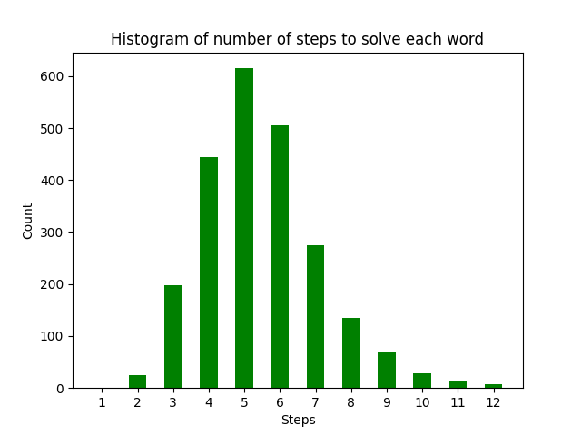

# Wordle Analysis Tool

</img>

## Intro

I've been learning both Python and Data Science recently, and I was looking for a fun real-world exercise to apply some of what I've been learning. Given that everyone is addicted to Wordle, I thought I'd do some analysis on Wordle solutions. I had a few questions in mind:

1. What is the best word to start with?
2. Given a dictionary of words, how many steps would it take on average to solve a Wordle puzzle?
3. How many steps does it take before the large list of words (~13,000) get pared down to something small?
4. Assuming the author of Wordle tried to pick well-known words, and assuming that most people don't know 13,000 five-letter words, what is a more realistic number of steps? Should an average person be able to solve every Wordle in 6 tries?

Note that this tool isn't design to help you make your next guess. It's designed to run through many wordle rounds in order to do an analysis on the overall game.

## Caveats

Wordle's *answer key* and *dictionary of allowed words* are both freely available online and easily viewable in Chrome's developer console. These two lists are included in this repo, but they've been alphabetized in the hopes that they aren't too much of a spoiler. Still, **don't look if you don't want to know**. I'm using these word lists as part of the solving algorithm. Note: I don't know when the New York Times will update the Wordle answer key, but it probably doesn't matter for the purpose of answering the questions in this exercise.

As you can see from the code, I'm not yet an expert Python developer. If you see areas where I could have coded something in a more python-like way, please submit an issue or leave a pull request.

## The Guess Algorithm

The core of this tool is the guessing algorithm. That's probably misnamed because it doesn't make the guess for you. Instead it reduces the dictionary based on the guess you give it using the rules of Wordle. You feed the guess algorithm with 1) your word guess, 2) the answer word, and a 3) dictionary of words that contains all allowable word guesses and answer words. The guess algorithm then does these steps:

1. Mark the guess word with "2" for exact matches (right letter, right spot), aka green squares. Mark the guess word with "1" for inexact matches (right letter, wrong spot), aka yellow squares. As with the real Wordle game, if an inexact matching letter appears in multiple places in a word, the first place is the one marked. This algorithm doesn't really care which one is marked, though.
2. Filter the dictionary of words you supplied based on the exact letter placements. For both debugging purposes and for Step 3, two filtered dictionaries are created. The first is the filtered word list. The second is the same filtered word list but with "-" in place of the exact character matches.
3. Further reduce this dictionary of words based on the remaining inexact letters, the yellow squares. This filtering uses the word list from Step 2 with the "-" in place of the exact letter matches so that if you have both green and yellow of the same letter, the green matches don't also count as yellow matches.
4. Finally, remove words from step 3's filtered dictionary that contain unique unmatched letters, the black squares. Also remove words that contain too many matches, e.g. a letter that appears in both a yellow and a black square.

This guess algorithm represents one guess...one step in the puzzle solution. To run the algorithm repeatedly towards a solution, you have to keep making guesses, each time feeding in the further-reduced list of dictionary words from the previous guess. The seed guess I use is a word with the highest frequency of letters (see below if you don't mind the spoiler). The subsequent gueses are done by having the algorithm randomly pick the next word from the filtered dictionary produced by the previous guess. The algorithm pretty quickly converges to a small list of words, but that doesn't mean every puzzle is solvable in 6 steps. See below for more.

## --------------- SPOILER BELOW ON BEST FIRST GUESS ----------------

## What is the best word to start with?

Let's take a look at two histograms. The first histogram shows the distribution of letters in the entire word list (allowable guesses + answers). The second shows a histogram of only the answer list. Based on this information, you would choose AROSE with the first list and ORATE with the second. Those choices would contain the most frequently occurring letters. Since we only care about the answers, ORATE is the world we'll start with in the rest of the simualtions.

You might wonder why these staring words and the letter distributions are so different, though. The answer is that the allowable guesses list has a shockingly high number of words that most people, myself included, have never heard of. The allowable guesses list wasn't intended to be only common words as far as I can tell. It was apparently intended to cover most 5-letter words in the English dictionary. In the charts below, I try a smaller dictionary to see how it affects game play.

## How many steps would it take on average to solve a Wordle?

As noted above, the dictionary of allowable words is quite large (~13,000 words) and is filled with a bunch of words most people don't know. So for this question, I'm assuming that someone could know all of the words in the dictionary and then just randomly pick words to get the next guess. In such a scenario, a typical distribution of the number of guesses required to solve every word is below. I'm starting with ORATE here, since it has the highest letter count in the answer key. The result makes some sense, given that the distribution is centered at 5 guesses. But there's still a long tail of losing rounds (rounds that take more than 6 guesses).

## How many steps does it take to get to a manangeable list?

Taking that last question, what does the dictionary look like at each step? How many steps will it take to reduce that 13,000 word dictionary down to a reasonable size? This is the same data set as the previous question, but tabulated differently. The table and chart below show that by the 4th guess, the list is quite small for the average round of Wordle. Also, on average, most rounds are solved by the 6th guess. That's great, but there is a huge range in dictionary size at each step, and for some rounds, the number of words remaining is still very large after 5 guesses.

|      | 1     |  2  |  3  |  4  |  5  |  6  | 7 | 8 | 9 | 10 | 11 | 12 | 13 |
| :--: | ----- | :--: | :-: | :-: | :-: | :-: | :-: | :-: | :-: | :-: | :-: | :-: | :-: |
| Min | 12972 |  1  |  0  |  0  |  0  |  0  | 0 | 0 | 0 | 0 | 0 | 0 | 0 |
| Mean | 12972 | 494 | 88 | 20 |  7  |  2  | 1 | 0 | 0 | 0 | 0 | 0 | 0 |
| Max | 12972 | 1491 | 703 | 312 | 214 | 181 | 79 | 29 | 16 | 12 | 10 | 5 | 2 |

## How much of a difference does a smaller dictionary make?

But we said that the allowable guesses dictionary has a huge number of words that most people don't know. If you don't believe me, take a look at the allowed guesses file in this repo. I suspect you won't know many if not most of the words listed. 

So let's run this again, but reduce the dictionary size to something that feels more manageable. The right way to do this would have been to go through the 13,000 words and pick ones that I thought were familiar. However, that's more work than I wanted to do, so instead I just took a random sample of the allowed guesses dictionary, figuring that this would be close enough statistically to get an answer to my question. I randomly picked 2000 words from the allowed words list and added in the 1315 answer words for a total of 4315 words. Again, I started with ORATE, since that's still the word from the answers with the highest letter usage.

As you can see, the mean shifted left, and the distribution got tighter, both indicators that in practical terms, solving a Worlde in 6 steps seems realistic for most words. This feels like a better representation of how people actually play the game. Yet even with the reduction, there are still a few words that have enough remaining dictionary words in the later steps to trip you up. I wonder if I had manually reduced the dictionary to common known words if the stats would improve even more.

|      | 1    |  2  |  3  |  4  | 5 | 6 | 7 | 8 | 9 | 10 |
| :--: | ---- | :-: | :-: | :-: | :-: | :-: | :-: | :-: | :-: | :-: |
| Min | 4315 |  1  |  0  |  0  | 0 | 0 | 0 | 0 | 0 | 0 |
| Mean | 4315 | 164 | 26 |  7  | 2 | 0 | 0 | 0 | 0 | 0 |
| Max | 4315 | 428 | 176 | 139 | 82 | 16 | 12 | 8 | 7 | 1 |

## Conclustion and Next Steps

I have more questions, but not enough time. 

1. If I did a manually reduction in the allowed guesses dictionary, would that tighten up the distribution even more?
2. What if ORATE is a good word statisitically, but not a good word practically? Is there a better starting word that drives down the solution list to a smaller set of possible words faster? I'm skeptical of this, but it's worth simulating.
3. Similarly, is there a subset of words in guesses two and three that would more quickly reduce the allowed guesses dictionary. For example, if I could memory 100 words, would that virtually guarantee that I could solve the puzzle in six steps?

There are probably other things I'll think of and simulate as a have time.
