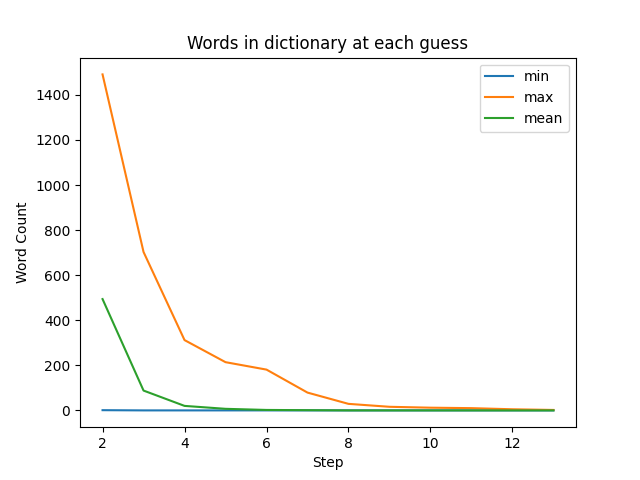
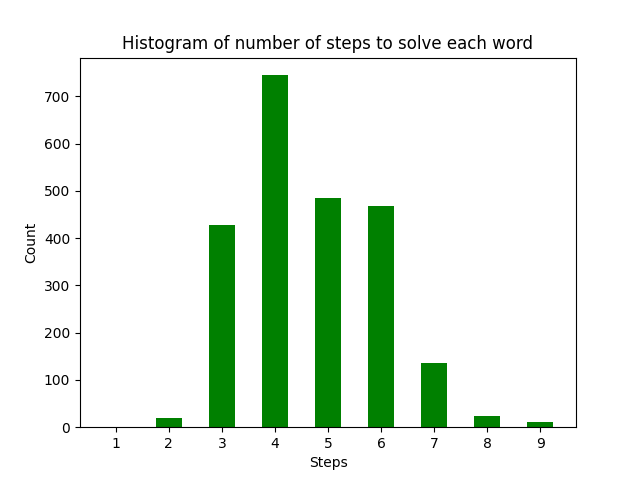

# Wordle Analysis Tool

## NOTE: updates coming to the charts since I fixed the algorithm

## Intro

Everyone's addicted to Wordle! I wrote this because I was curiuos about a few things.

1. What is the best word to start with?
2. How many steps does it take before the large list of words (~13,000) get pared down to something small?
3. After a couple of steps, is there a good subset of words to know that will ensure success?
4. Given a dictionary of words, how many steps would it take on average to solve a Wordle?
5. Assuming the author of Wordle tried to pick well known words, and assuming that most people don't know 13,000 5-letter words, what is the most realistic number of solving steps? In other words, should an average person be able to solve every Wordl in 6 tries?

This tool isn't design to help you make your next guess. It's designed to run through many wordle rounds in order to do analysis on the overall game.

## Caveats

Wordle's *answer key* and *dictionary of allowed words* are both freely available online and easily viewable in Chrome's developer console. These two lists are included in this repo, but they've been alphabetized in the hopes that they aren't too much of a spoiler. Still, **don't look if you don't want to know**. I'm using these word lists as part of the solving algorithm.

As you can see from the code, I'm not an expert Python developer. I've been learning both Python and Data Science, and this seemed like a fun real-world exercise. As with any language, you have to program in it for a while to become fluent. If you see areas where I could have coded something in a more python-like way, please make an issue or leave a pull request.

Finally, this is work in progress.

## The Solving Algorithm

You feed the guess algorithm with 1) your word guess, 2) the answer word, and a 3) dictionary of words that contains all allowable word guesses and answer words. The guess algorithm does these steps:

1. Mark the guess word with "2" for exact matches (right letter, right spot), aka green squares. Mark the guess word with "1" for inexact matches (right letter, wrong spot), aka yellow squares. As with the real Wordle game, if an inexact matching letter appears in multiple places in a word, the first place is the one marked.
2. Filter the dictionary of words based on the exact letter placements. For both debugging purposes and for Step 3, two dictionaries are created. The first is the filtered word list. The second is the filtered word list with "-" in place of the exact character matches.
3. Filter the reduced dictionary of words based on the remaining inexact letters, the yellow squares. This filtering uses the word list from Step 2 with the "-" in place of the exact letter matches so that if you have two of the same letter, they don't also count as inexact matches.
4. Finally, remove words from this filtered dictionary that contain unmatched letters, the black squares. One caveat here is if a letter is in both a yelllow square and a black square, I don't remove words that contain only one instance of that letter, rather than two (or more). This was for implementation expediency, but it technically means that there could be a very few number of words left after this step that aren't actually good guesses because they contain too many inexact matching letters. I will go back and fix this at some point, but I believe this impact to be very small relative to the stats I'm trying to gather.

So this guess algorithm represents one guess. To run the algorithm repeatedly towards a solution, you have to keep making guesses, each time feeding in the further-reduced list of words. The seed guess I use is a word with the highest frequency of letters (see below if you don't mind the spoiler). The subsequent gueses are done by having the algorithm randomly pick the next word from the filtered dictionary produced by the previous guess. The algorithm quickly converges to a small list of words, but there can be a long tail as the algorithm picks between the remaining handful of words which are close enough to not bring about big reductions in the filtered dictionary.

## --------------- SPOILER BELOW ON BEST FIRST GUESS ----------------

## What is the best word to start with?

This was the first surprise. Let's take a look at two histograms. The first histogram shows the distribution of letters in the entire word list (allowable guesses + answers). The second shows a histogram of only the answer list. Based on this information, you would choose AROSE with the first list and ORATE with the second. Of cousre, we only care about the answers, so ORATE is the world we'll start with in the rest of the simualtions.

You might wonder why these are different, though. The short answer is that the allowable guesses list has a shockingly high number of words that that most people, msylef included, have never heard of. The guess list wasn't intended to be only common words. It was apparently intended to cover most 5-letter words in a dictionary. In the charts below, I try a smaller dictionary to see how it affects game play.

## How many steps does it take to get to a manangeable list?

[1, 2, 3, 4, 5, 6, 7, 8, 9, 10, 11, 12, 13, 14]

Mins:  [12972, 1, 0, 0, 0, 0, 0, 0, 0, 0, 0, 0, 0, 0]

Maxes: [12972, 1491, 1290, 372, 284, 214, 53, 41, 36, 36, 36, 3, 2, 1]

Means: [12972, 494, 92, 21, 7, 2, 0, 0, 0, 0, 0, 0, 0, 0]

## After a couple of steps, is there a good subset of words to know that will ensure success?

TODO

## How many steps would it take on average to solve a Wordle?

As noted above, the dictionary of allowable words is quite large (~13,000 words) and is filled with a bunch of words most people don't know. So for this question, we're assuming that someone could know all of the words in the dictionary and then just randomly pick words to get the next guess. In such a scenario, a typical distribution of the number of guesses required to solve every word is below. Again, we're starting with ORATE here, since it has the highest letter count in the answer key.

## How much of a difference does a smaller dictionary make?

But the last questions obscures the fact that most people probalby know maybe 3000 words out of that exhaustive dictionary of 13,000. So let's run this again, but reduce the dictionary size. I didn't feel like going through the entire dictionary and trying to pull out known common words, so I just took a random sample of the dictionary, figuring that this would be close enough to get an idea. I randomly picked 2000 words from the allowed words list and added in the 1315 answer words for a total of 4315 words. Again, I started with ORATE. As you can see, the mean shifted left, and the distribution got tighter. This feels like a better representation of how people actualy play the game. But even with the reduction, there's still a few words that have enough remaining dictionary words in the later steps to trip you up.

